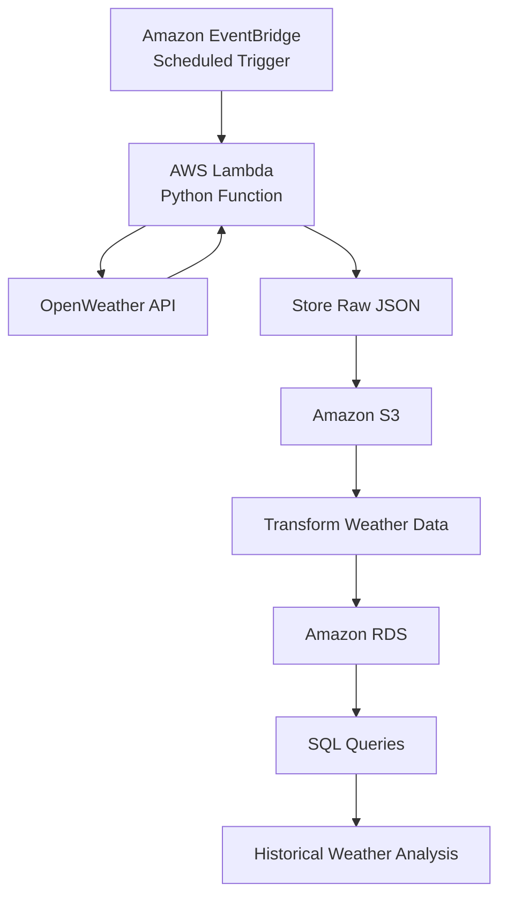

# 🌦️ Weather Data Ingestion System

A cloud-native weather data ingestion system built with Python and AWS that automatically retrieves weather data from the OpenWeather API, stores raw API responses in Amazon S3, and loads processed weather records into Amazon RDS for historical analysis.

---

## Overview

This project demonstrates a serverless ETL (Extract, Transform, Load) pipeline using Python and AWS services. The application automatically retrieves weather data for **Lagos (Ikeja)** from the OpenWeather API on a scheduled basis. The raw API response is archived in Amazon S3, transformed using AWS Lambda, and stored in Amazon RDS for historical analysis and SQL querying.

---

## Architecture

---

# AWS Services

### Amazon EventBridge

EventBridge schedules and automatically triggers the AWS Lambda function at predefined intervals.

---

### AWS Lambda

AWS Lambda executes the Python ETL script, retrieves weather data from the OpenWeather API, processes the response, and coordinates data storage.

---

### Amazon S3

Amazon S3 stores raw weather API responses, providing a backup of the original data before transformation.

---

### Amazon RDS

Processed weather data is stored in Amazon RDS, allowing historical weather information to be queried using SQL.

---

## Workflow

1. Amazon EventBridge triggers the AWS Lambda function on a scheduled interval.
2. AWS Lambda requests weather data from the OpenWeather API.
3. The raw JSON response is stored in Amazon S3.
4. The data is transformed into a structured format.
5. Processed weather records are inserted into Amazon RDS.
6. Historical weather data can be queried for reporting and analysis.

---

## Features

- Automated weather data collection
- Scheduled serverless execution
- OpenWeather API integration
- Raw JSON backup in Amazon S3
- Historical weather storage in Amazon RDS
- SQL-ready relational database
- Modular and reusable Python code

---

## Technology Stack

- Python
- AWS Lambda
- Amazon EventBridge
- Amazon S3
- Amazon RDS
- OpenWeather API
- SQL
- Git & GitHub

---

## Skills Demonstrated

- Python Programming
- REST API Integration
- Cloud Computing (AWS)
- Serverless Computing
- ETL Pipeline Development
- Relational Database Design
- SQL
- Workflow Automation
- Software Engineering
- Version Control (Git)

---

## Lessons Learned

This project strengthened my understanding of building cloud-based software systems and automated data pipelines. Through its development, I gained practical experience with:

- Designing serverless applications using AWS Lambda
- Automating scheduled workflows with Amazon EventBridge
- Integrating external REST APIs
- Building ETL pipelines for reliable data processing
- Storing raw and processed data using Amazon S3 and Amazon RDS
- Writing modular and maintainable Python code

---

## Future Improvements

- Support multiple cities
- Containerize the application using Docker
- Add CI/CD with GitHub Actions
- Deploy infrastructure using Terraform
- Build a web dashboard for weather visualization
- Implement monitoring with Amazon CloudWatch
- Add automated unit and integration tests

---

## Author

**Abdulaziz Shina Abdulaziz**

GitHub: https://github.com/heyzed001
