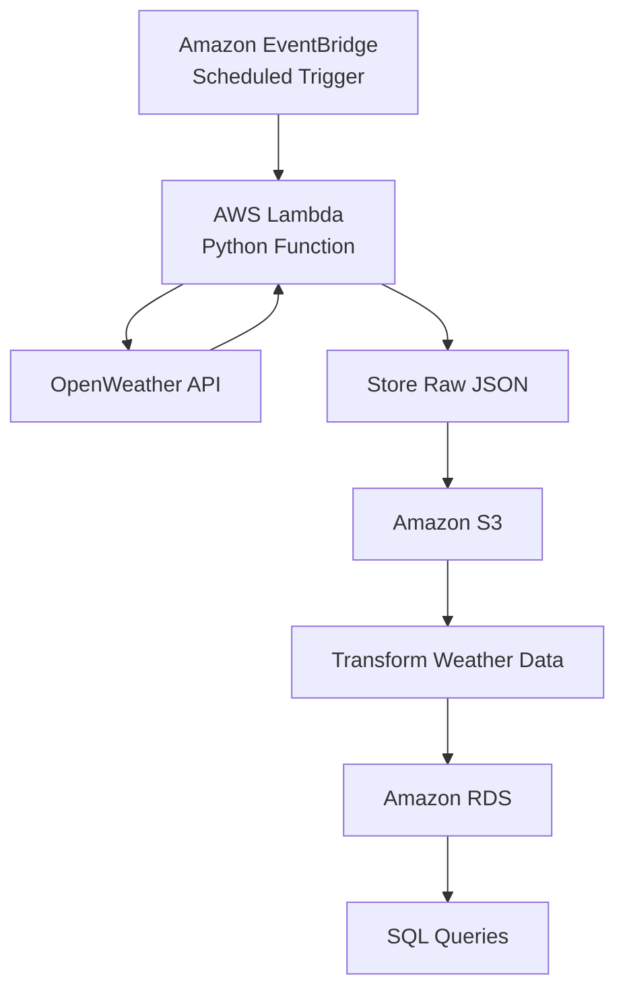
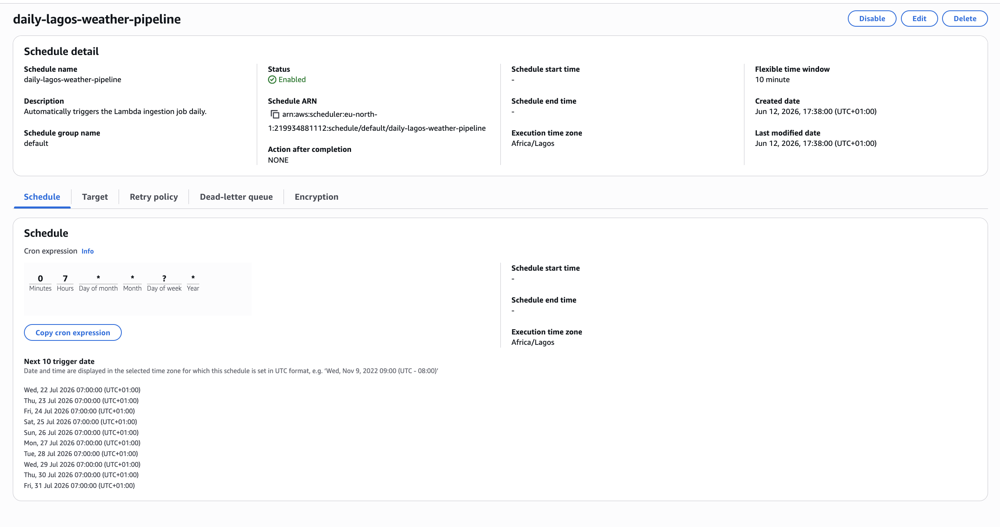
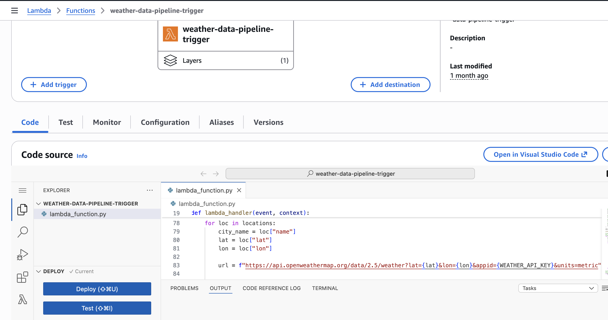
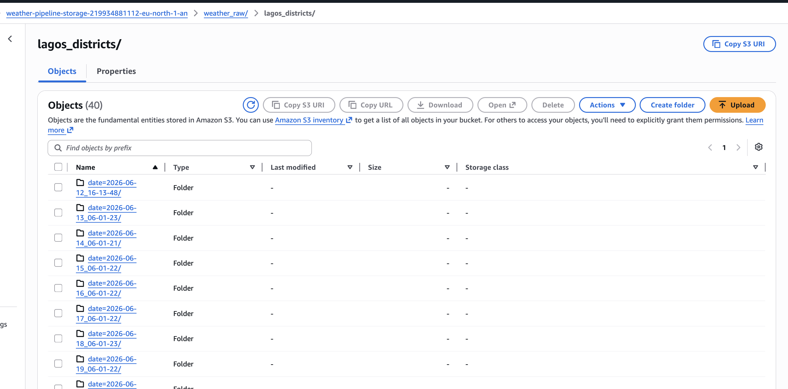
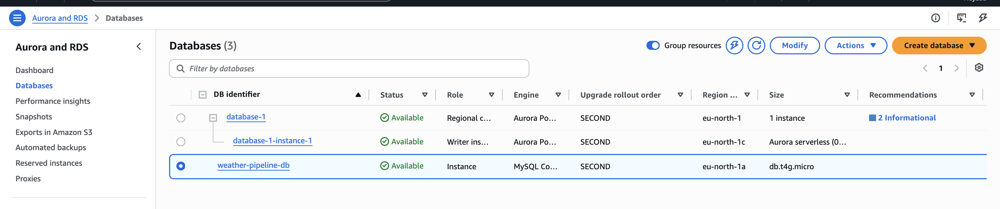
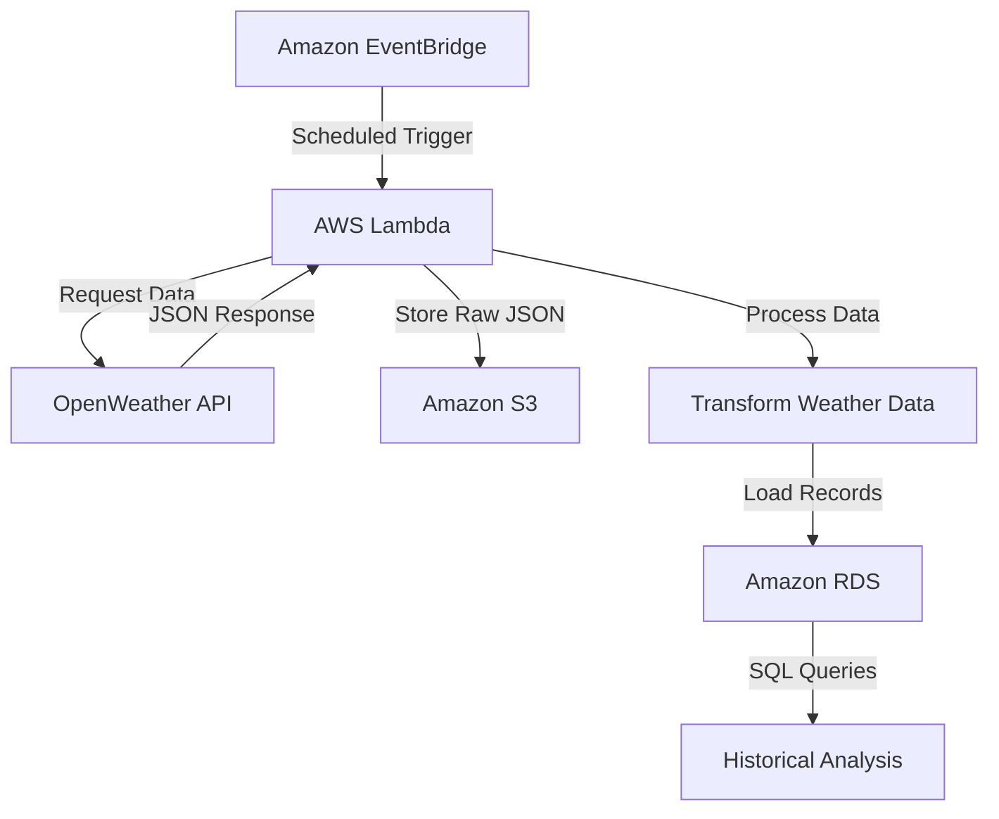

# 🌦️ Weather Data Ingestion System

A cloud-native weather data ingestion system built with Python and AWS that automatically retrieves weather data from the OpenWeather API, stores raw API responses in Amazon S3, and loads processed weather records into Amazon RDS for historical analysis.

---

## Overview

This project is a cloud-based, serverless ETL pipeline that automates the **daily extraction, transformation, and storage** of weather data using Python and AWS. On a scheduled basis, Amazon EventBridge triggers an AWS Lambda function to retrieve weather data for **Lagos** from the OpenWeather API. The raw JSON response is stored in Amazon S3 for backup, while the processed data is loaded into Amazon RDS, enabling historical weather tracking and SQL-based analysis.

---

## Architecture

---

# AWS Services

### Amazon EventBridge

EventBridge schedules and automatically triggers the AWS Lambda function at predefined intervals.

---

### AWS Lambda

AWS Lambda executes the Python ETL script, retrieves weather data from the OpenWeather API, processes the response, and coordinates data storage.

---

### Amazon S3

Amazon S3 stores raw weather API responses, providing a backup of the original data before transformation.

---

### Amazon RDS

Processed weather data is stored in Amazon RDS, allowing historical weather information to be queried using SQL.

---
## Workflow

---

## Features

- Automated weather data collection that runs every morning
- Scheduled serverless execution
- OpenWeather API integration
- Raw JSON backup in Amazon S3
- Historical weather storage in Amazon RDS
- SQL-ready relational database
- Modular and reusable Python code

---
## Technologies Used

| Category | Technologies |
|----------|--------------|
| Programming | Python, SQL |
| Cloud Platform | AWS Lambda, Amazon EventBridge, Amazon S3, Amazon RDS |
| API | OpenWeather API |
| Concepts | ETL Pipeline, Serverless Architecture, Workflow Automation |
| Tools | Git, GitHub |

---

## Key Learnings

Developing this project expanded my understanding of cloud-based software systems and automated data pipelines. Throughout the project, I gained practical experience in:

- Building serverless applications with AWS Lambda
- Automating scheduled workflows using Amazon EventBridge
- Integrating external REST APIs
- Designing ETL pipelines for reliable data processing
- Managing raw and processed data with Amazon S3 and Amazon RDS
- Writing modular, maintainable Python code

---

## Future Improvements

- Extend support to multiple locations.
- Develop a web dashboard for interactive weather visualization.
- Add automated notifications for significant weather events.
- Improve application performance and error handling.
- Enhance data quality with validation and monitoring.
- Deploy the system for production use with continuous monitoring.

---

## Author

**Abdulaziz Shina Abdulaziz**

GitHub: https://github.com/heyzed001
