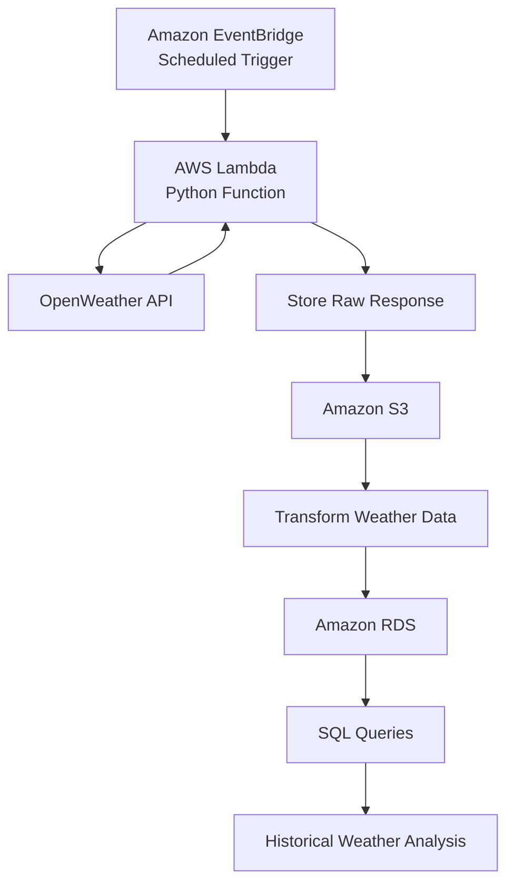

# 🌦️ Weather Data Ingestion System

A cloud-native weather data ingestion system built with Python and AWS that automatically retrieves weather data from the OpenWeather API, stores raw API responses in Amazon S3, and loads processed weather records into Amazon RDS for historical analysis.

---

## Overview

This project demonstrates the design and implementation of a serverless ETL (Extract, Transform, Load) pipeline using AWS cloud services.

The application automatically collects weather data for **Lagos (Ikeja)** from the OpenWeather API on a scheduled basis. The raw API response is archived in Amazon S3, transformed using AWS Lambda, and stored in an Amazon RDS database, where it can be queried for historical weather analysis.

---

## Architecture

---

## Features

- Automated weather data collection
- Serverless execution using AWS Lambda
- Scheduled automation with Amazon EventBridge
- OpenWeather REST API integration
- Raw JSON backup in Amazon S3
- Historical weather storage in Amazon RDS
- SQL-ready database for querying and analysis
- Modular Python code for easy maintenance and extension

---

## Technologies

- Python
- AWS Lambda
- Amazon EventBridge
- Amazon S3
- Amazon RDS
- OpenWeather API
- SQL
- Git & GitHub

---

## Workflow

1. Amazon EventBridge triggers the AWS Lambda function on a scheduled interval.
2. Lambda retrieves current weather data from the OpenWeather API.
3. The raw API response is stored in Amazon S3.
4. The weather data is extracted and transformed into a structured format.
5. Processed records are inserted into Amazon RDS.
6. Historical weather data becomes available for SQL queries and reporting.

---

## Example Use Cases

- Historical weather tracking
- Weather trend analysis
- Data engineering practice
- Cloud ETL workflows
- SQL reporting and analytics

---

## Skills Demonstrated

- Python Programming
- REST API Integration
- Cloud Computing (AWS)
- Serverless Architecture
- ETL Pipeline Development
- Relational Database Design
- SQL
- Workflow Automation
- Software Engineering
- Version Control (Git)

---

## Lessons Learned

This project strengthened my understanding of designing cloud-based software systems and automated data pipelines. Through its development, I gained practical experience with:

- Building serverless applications using AWS Lambda
- Automating workflows with Amazon EventBridge
- Integrating external REST APIs
- Designing ETL pipelines for reliable data processing
- Storing and querying structured data in Amazon RDS
- Using Amazon S3 for cloud storage and data backup
- Writing modular and maintainable Python code

---

## Future Improvements

- Support multiple cities
- Containerize the application with Docker
- Add CI/CD using GitHub Actions
- Deploy infrastructure with Terraform
- Build a Streamlit dashboard for weather visualization
- Add automated unit and integration tests
- Implement CloudWatch monitoring and alerting

---

## Author

**Abdulaziz Shina Abdulaziz**

- GitHub: https://github.com/heyzed001
- LinkedIn: *(Add your LinkedIn profile)*
